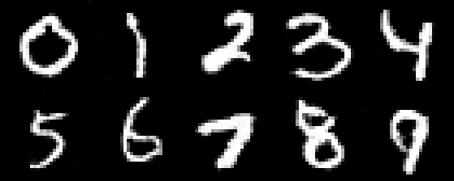

# Flow Matching for Image Generation



This repository implements an image generation model in Rust using the Burn framework. This model is a flow matching model trained on MNIST dataset. 

## 1. Algorithm

### 1.1 Flow Matching
In flow matching, we model the generation process as a **conditional Gaussian probability path**. The "condition" is our target, and "probability path" describes how a random noise gradually converges into a fixed target.

\[p_t(\cdot|z) = N(\alpha_t z, \beta_t^2 I_d), t \isin [0,1]\]

Where $\alpha_t$ goes from 0 to 1, $\beta_t$ changes from 1 to 0, and $z$ is our target (e.g. a picture). In my implementation, I choose $\alpha_t = t$ and $\beta_t = 1-t$. There are two edge cases:

\[p_0(\cdot|z) = N(0,I), p_1(\cdot|z) = N(z,0)\]

We now have a path that goes from noise to target image. We then need to actually compute this path. To achieve this, we introduce the **conditional vector field**. We can use this vector field to form an ODE: 

\[\frac{d}{dt} x_t = u_t^{target} (x_t|z)\]

What we want is that after simulating this ODE, we get 

\[x_t \sim p_t(\cdot|z)\]

For Gaussian probability path, we can derive the **conditional Gaussian vector field** mathematically:

\[u_t^{target}(x|z)=(\dot\alpha_t-\frac{\dot\beta_t}{\beta_t}\alpha_t)z + \frac{\dot\beta_t}{\beta_t}x\]

Where $\dot \alpha_t$ and $\dot \beta_t$ are derivatives based on $t$. In my implementation, $\dot \alpha_t=1$ and $\dot \beta_t =-1$. So the above formula is equivalent to 

\[u_t^{target}(x|z)=(1+\frac{t}{1-t})z - \frac{1}{1-t}x\]

Since we do not have $z$ during the generation process, we can train a neural network that learns the vector field. We will train the network using the following loss function:

\[L(\theta) = \| u_t^{\theta}(x) - u_t^{target}(x|z)\|\]

Where $t \sim U(0,1)$ and $x \sim p_t(\cdot|z)$. For a fixed target $z$, our network will learn a vector field that can transform any noise into $z$. After obtaining the vector field, we can simulate the ODE using **forward Euler** method:

\[x_{t+h} = x_t + h u_t^{\theta}(x_t)\]

Now our algorithm works for only one target (i.e. we can only generate **exactly one** image). By randomly sampling targets from training dataset $z \sim p_{data}$, our model can generate samples subject to distribution $p_{data}$. 

### 1.2 Conditional Generation
After previous steps, our model can generate samples from distribution $p_{data}$. For example if $p_{data}$ contains images of dogs, our model is a dog-generator. 

If $p_{data}$ contains images of both dogs and cats, our model still works. However, we cannot specify which animal to generate. To put this formally, we can only generate a sample from $p_{data}$, and we cannot control the content. To achieve this goal, we will need a **prompt** $y$, which controls the target distribution:

\[z \sim p_{data}(\cdot|y)\]

For example, $p_{data}(\cdot|"cat")$ should only contain images of cats. Our neural network should also see this extra information, thus the loss function becomes

\[L(\theta ; y) = \| u_t^{\theta}(x|y) - u_t^{target}(x|z)\|\]

Normally, each image has a label. In this case, $z$ and $y$ come together from the dataset. What we need to do is randomly sample $z$ from dataset, then give its label $y$ to our network. 

To generate an image using our network, we first select a prompt $y$ and an initial noise $x_0$. Then, we simulate the following ODE using forward Euler method:

\[\frac{d}{dt} x_t = u_t^{\theta} (x_t|y)\]

### 1.3 Implementation Details 
Our neural network inputs an image and outputs its vector field, so input and output tensors have the same shape. **U-Net** is suitable for this task, because it preserves the shapes. **Diffusion transformer (DiT)** is also powerful. For simplicity concerns, I choose U-Net in this project. 

Our neural network should also "see" the current time $t$ and prompt $y$. For $t$ ranges from 0 to 1, I use **sinusoidal embedding** to encode time information. Since $y$ is just a label from 0 to 9 in MNIST dataset, I use **one-hot encoding** to encode prompts.

Burn currently does not support bilinear interpoation, so I'm using nearest neighbor interpolation.

## 2. Installation
Thanks to Cargo, it is very easy to build and run this project on different devices. To train the model and generate some pictures, just run: 

```
cargo run --release
```

The trained model will be saved in "./model" directory, and the generated samples will be saved in "./result" directory.

Here are the default training configurations. You might need to adjust the batch size to match your own device. (The following configuration works for an Nvidia A100).

```Rust
#[derive(Config)]
pub struct TrainingConfig {
    #[config(default = 10)]
    pub num_epochs: usize,
    #[config(default = 32)]
    pub batch_size: usize,
    #[config(default = 1)]
    pub num_workers: usize,
    #[config(default = 42)]
    pub seed: u64,
    #[config(default = 1e-4)]
    pub lr: f64,
}
```

In general, Burn is as fast as PyTorch. However, their performance comes from different ways. PyTorch has a very effective GPU management strategy, which allows us to use a larger batch size, thus leading to higher GPU utilization. I have translated this whole project into PyTorch, and I found that 128 is a valid batch size. Besides, PyTorch is based on C and CUDA, allowing it to have higher performance.

On the other hand, Burn uses Rust compiler to optimize the code, leading to human-expert-level quality. For example, running the code with/without `--release` flag can introduce a 10x performance gap. 

## 3. Acknowledgemtns 
*MIT 6.S184* gives a clear introduction to generative AI: https://diffusion.csail.mit.edu/ 

*The Burn Book* is great for learning the Burn framework: https://burn.dev/books/burn/